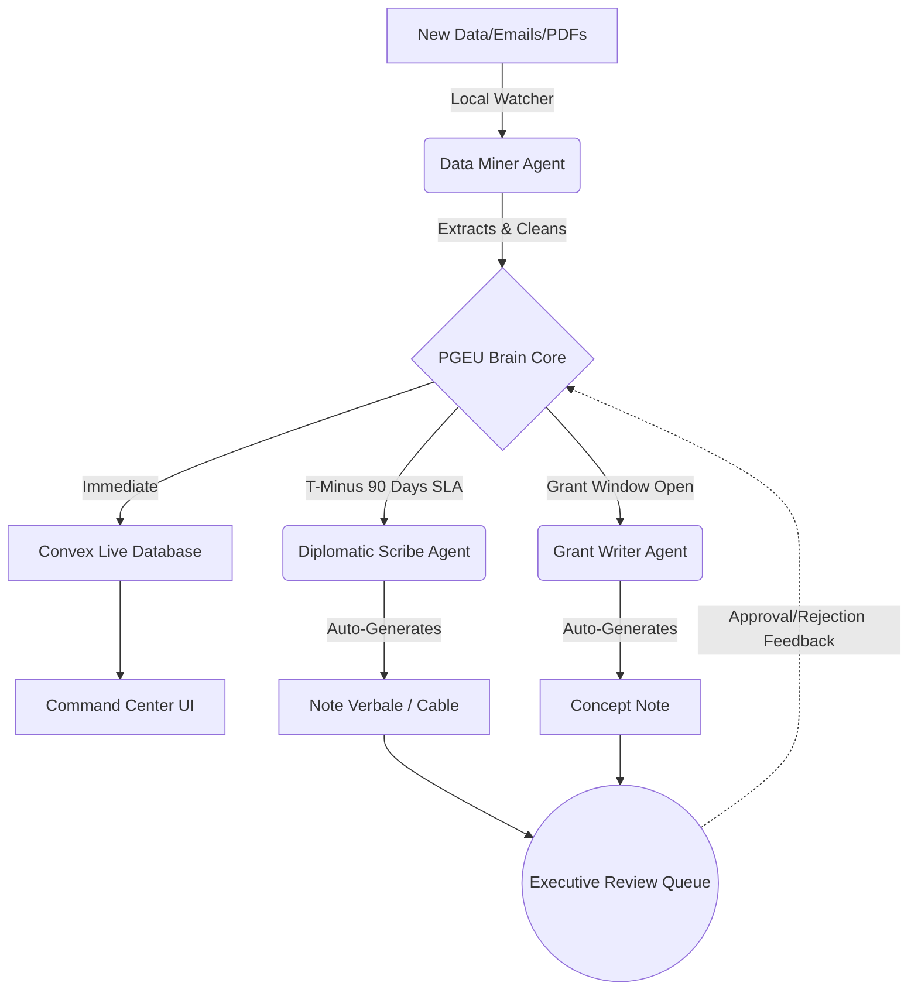

# PGEU AUTONOMOUS WORKFLOW & CONTINUOUS IMPROVEMENT LOOP

## 1. The Diagnostic: Why the Previous System Failed

Based on a full review of our work and the crashes we experienced, the previous system failed because it was **reactive rather than proactive**. 

1. **The Human Dependency:** The AI Agentic Team (Data Miner, Grant Writer, Diplomatic Scribe) only ran when manually triggered via terminal commands (`python3 pgeu_engine.py`). AI should not wait for human permission to do its job.
2. **Hardcoded Bottlenecks:** Built-in safeguards (like the `added < 5` limit) actively suppressed intelligence to prevent UI clutter, resulting in missed critical events like the World Forum for Democracy.
3. **No Temporal Awareness (SLA Failures):** The system tracked dates but didn't *understand* deadlines. An event 3 months away requires action *today*, but the system passively waited until the event expired.

---

## 2. The Solution: The Continuous Improvement Loop

To build the "best system underneath", we must transition from a *script-based tool* to an **Autonomous Agentic Pipeline**. The agents must run continuously, learn from new data, and escalate automatically.

---

## 3. The 4-Phase Autonomous Workflow Map

### Phase 1: The Watcher (Autonomous Mining)
- **Action:** Instead of manual sweeps, we implement a background chron-job (or Vercel cron).
- **Agent:** *Digital Auditor*
- **Protocol:** Scans designated local folders (`/DOCS`, `/EMAILS`) every 24 hours. Any new PDF or correspondence is instantly processed into `EXTRACTED_EVENTS_FULL.json`.

### Phase 2: The Engine (Intelligent Seeding)
- **Action:** The data is pushed live without limits.
- **Agent:** *System Core*
- **Protocol:** The engine cross-references the new data against the existing Convex database. Duplicates are merged. Missing data is filled. The live UI updates automatically.

### Phase 3: The Escalator (SLA Triggers)
- **Action:** The system checks the calendar daily against strict Service Level Agreements (SLAs).
- **Agent:** *Executive Orchestrator*
- **Protocols:**
  - **T-Minus 90 Days (Diplomacy):** Automatically triggers `/friends-play` to draft Note Verbales for visas and official invites.
  - **T-Minus 45 Days (Logistics):** Automatically generates the `EVENT_PREP` briefing.
  - **72-Hour Response SLA:** Flags any unanswered international correspondence in Red on the Command Center.

### Phase 4: The Dispatcher (Zero-Friction Delivery)
- **Action:** You no longer need to check terminal logs.
- **Delivery:** When a trigger is hit, the Diplomatic Scribe generates the document and pushes it directly to an **"Action Required"** queue in the live Next.js Command Center. You just click "Approve" or "Download".

---

## 4. Implementation Steps (User Approval Required)

To activate this loop immediately, I propose we execute the following steps:

1. **[NEW] Add Temporal Logic to `pgeu_engine.py`:** I will write the "T-Minus 90" SLA logic so the engine can independently identify what needs immediate action.
2. **[NEW] Build the Automation Trigger:** Set up a scheduled task (either a local macOS `crontab` or a Vercel cron endpoint) to run the `pgeu_engine.py /deep-sweep` autonomously every day at 00:00.
3. **[MODIFY] Command Center UI:** Update the Vercel dashboard to include a flashing "Action Required" panel that shows you exactly what the agents drafted for you overnight.

> [!IMPORTANT]
> **User Review Required:** Do you approve the creation of this Autonomous Pipeline? If yes, I will immediately begin coding the Temporal Logic and setting up the automated triggers.
